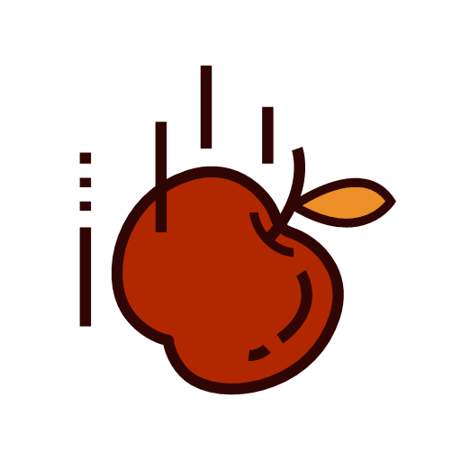

# 🏗 Matter.cpp – 2D Physics Engine in C++

## 🚀 Description

**Matter.cpp** is a **C++23** 2D physics engine for real-time simulation of **rigid polygonal bodies**. It supports collision handling, rotation, and forces to create dynamic and precise physics simulations.

### 🔥 Key Features

- **Rigid bodies**: Supports polygons (boxes, custom shapes, etc.).
- **Force-based physics engine**: Velocity, acceleration, gravity.
- **Collision & AABB**: Bounding box collision detection and handling.
- **Rotation & transformation**: Angle and movement management.
- **SFML support** (optional) for graphical rendering.

---

## 📥 Installation

### 🔷 Requirements

- **C++23**
- **CMake** (for compilation)
- **SFML** *(optional, for graphical rendering)*

### 📦 Setup

You can use **Matter.cpp** as a library by placing the `MATTER` folder inside your system's `include` directory and the compiled `.a` file inside your `lib` directory.

Alternatively, you can clone and compile it manually:

```bash
git clone https://github.com/ChiroYuPy/Matter.cpp.git
cd Matter.cpp
mkdir build && cd build
cmake ..
make
```

---

## 🎮 Usage

### 🏗 Example: Physics Simulation with SFML

The following code demonstrates how to use **Matter.cpp** with **SFML** to create a simple physics simulation with a box and multiple balls.

```cpp
#include <SFML/Graphics.hpp>
#include <MATTER/Matter.h>
#include <memory>
#include <vector>
#include <cstdlib>

int main() {
    sf::RenderWindow window(sf::VideoMode(800, 600), "Physics Simulation");
    World world;
    world.setGravity({0, 98.1f});

    std::vector<std::unique_ptr<Box>> boxes;
    boxes.push_back(std::make_unique<Box>(Vector2f(400, 10), 800, 20)); // Ground
    boxes.back()->setInert(true);
    
    std::vector<std::unique_ptr<Ball>> balls;
    for (int i = 0; i < 3; ++i) {
        auto ball = std::make_unique<Ball>(Vector2f(400, 100 + i * 50), 16);
        world.addRigidBody(ball.get());
        balls.push_back(std::move(ball));
    }
    
    while (window.isOpen()) {
        sf::Event event;
        while (window.pollEvent(event)) {
            if (event.type == sf::Event::Closed)
                window.close();
        }

        world.update(1.0f / 60.0f);
        window.clear();
        
        for (auto& ball : balls) {
            sf::CircleShape shape(ball->getRadius());
            shape.setOrigin(ball->getRadius(), ball->getRadius());
            shape.setPosition(ball->getPosition().x, ball->getPosition().y);
            shape.setFillColor(sf::Color::Green);
            window.draw(shape);
        }
        
        window.display();
    }
    return 0;
}
```

---

## 📌 Examples & Demos

- **Rigid Body Simulation**: Boxes and balls interacting with gravity.
- **Collision Handling**: Real-time collision response.
- **SFML Rendering**: Visualize physics simulations.

---

## 🤝 Contribution

Want to improve **Matter.cpp**? Contributions are welcome! 🚀

1. **Fork** the project
2. Create a **branch** (`git checkout -b feature/improvement`)
3. **Commit** your changes (`git commit -am "Fix Polygon transformation"`)
4. **Push** to your repo (`git push origin feature/improvement`)
5. Submit a **Pull Request**

---

## 📝 License

This project is under the MIT License. See the [LICENSE](LICENSE) file for more details.

🔗 **Author**: [ChiroYuPy](https://github.com/ChiroYuPy)  
⭐ **If you like this project, don't forget to leave a star!**

